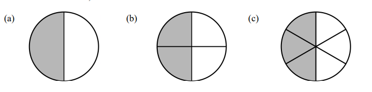

## 分数、真分数、假分数和带分数  Fraction, Proper Fraction, Improper Fraction and Mixed Number

> 在现实世界中，我们经常遇到介于两个整数之间的数量。比如，我们有半杯面粉，
> 或者跑了四分之一千米。我们使用分数来表示不是整数的数量。

**_Exercise #1._** 思考 $\frac{2}{5}$ 和 $\frac{7}{5}$。

1. 以下矩形被分割成5个相同的部分，涂颜色指出矩形的 $\frac{2}{5}$：

   <svg width="200" height="100" viewBox="0 0 200 100" xmlns="http://www.w3.org/2000/svg">
   <rect x="0" y="0" width="40" height="100" stroke="black" fill="none"/>
   <rect x="40" y="0" width="40" height="100" stroke="black" fill="none"/>
   <rect x="80" y="0" width="40" height="100" stroke="black" fill="none"/>
   <rect x="120" y="0" width="40" height="100" stroke="black" fill="none"/>
   <rect x="160" y="0" width="40" height="100" stroke="black" fill="none"/>
   </svg>

2. 以下两个矩形被分割成5个相同的部分，指出矩形的 $\frac{7}{5}$：
   然后转换此 **假分数** 成 **带分数** 的形式

   <svg width="200" height="100" viewBox="0 0 200 100" xmlns="http://www.w3.org/2000/svg">
   <rect x="0" y="0" width="40" height="100" stroke="black" fill="none"/>
   <rect x="40" y="0" width="40" height="100" stroke="black" fill="none"/>
   <rect x="80" y="0" width="40" height="100" stroke="black" fill="none"/>
   <rect x="120" y="0" width="40" height="100" stroke="black" fill="none"/>
   <rect x="160" y="0" width="40" height="100" stroke="black" fill="none"/>
   </svg>
   <svg width="240" height="100" viewBox="0 0 240 100" xmlns="http://www.w3.org/2000/svg">
   <rect x="0" y="0" width="40" height="100" stroke="none" fill="none"/>
   <rect x="40" y="0" width="40" height="100" stroke="black" fill="none"/>
   <rect x="80" y="0" width="40" height="100" stroke="black" fill="none"/>
   <rect x="120" y="0" width="40" height="100" stroke="black" fill="none"/>
   <rect x="160" y="0" width="40" height="100" stroke="black" fill="none"/>
   <rect x="200" y="0" width="40" height="100" stroke="black" fill="none"/>
   </svg>

   带分数：

3. 根据以上结果，将假分数 $\frac{23}{5}$ 转换成带分数，解释你的思考过程

 

**_Exercise #2._** 转换以下假分数为带分数

$$
\frac{15}{4}\qquad\qquad\qquad    \frac{33}{7}
$$

 

**_Exercise #3._** 带分数转换成假分数，思考带分数: ${4}\frac{3}{4}$

1.将以下三个矩形平均分成4个相同的部分,有多少个 $\frac{1}{4}$ ？

<svg width="200" height="160" viewBox="0 0 200 160" xmlns="http://www.w3.org/2000/svg">
  <rect x="20" y="10" width="160" height="40" stroke="black" fill="none" stroke-width="2"/>
  <rect x="20" y="60" width="160" height="40" stroke="black" fill="none" stroke-width="2"/>
  <rect x="20" y="110" width="160" height="40" stroke="black" fill="none" stroke-width="2"/>
</svg>

2. 将带分数 ${4}\frac{3}{4}$ 写成加法形式，然后转换成假分数

 

**_Exercise #4._** 转换以下带分数为假分数

$$
{5}\frac{1}{2}\qquad\qquad\qquad    {7}\frac{3}{4}
$$

 

> 真分数：真分数是指大于0小于1的所有分数。 这些分数的特点是“分母大于分子”。

> 假分数：分子大于或者等于分母的分数叫假分数，假分数大于1或等于1。

> 带分数：带分数是假分数的一种形式。非零自然数与真分数相加（负整数时与真分数相减）所成的分数（或真分数与假分数相加减化简后的数），一般读作几又几分之几，假分数的倒数**一定**不大于一。

## 等值分数   Equivalent Fractions

> 我们很容易忘记分数和整数一样都代表数量。 最大的区别在于，整数通常只有一种表示方式， **而分数可以用多种方式表示相同的数量**。

 

**_Exercise #1._** 思考下图，每一个圆形的一部分都被阴影覆盖，指出每一个阴影部分所占圆形的比例。

$$
\text{等值分数}
$$

$$
\text{如果 }\frac{a}{b} \text{ 是一个分数，那么 } \frac{a \times c}{b \times c} \text{ 表示一个等值分数}
$$

$$
Explain\space the\space defination\space above \space with \space your \space own \space words
$$

 

**_Exercise #2._** 下列哪个分数与 $\frac{8}{5}$ 不等值？

$$
\frac{16}{10}\qquad\qquad\qquad    \frac{40}{25}
$$

 

$$
\frac{10}{7}\qquad\qquad\qquad    {1}\frac{3}{5}
$$

 

我们可以用**等值分数**的概念来把一个分数化成**最简形式**。 最简形式：$simplest\space form$

 

**_Exercise #3._** 观察分数 $\frac{12}{8}$

1. 12 与 8 的最大公约数是多少？最大公约数：$greatest\space common\space factor (gcf)$

2. 将分子和分母都除以最大公约数

3. 为什么 2. 中得到的分数是 $\frac{12}{8}$ 的等值分数?

 

**_Exercise #4._** 写出以下分数的最简形式

$$
\frac{12}{15}\qquad\qquad\qquad    \frac{25}{40}
$$

 

$$
\frac{88}{16}\qquad\qquad\qquad    \frac{42}{60}
$$

 

**_Exercise #5._** 以下哪个分数不是 $\frac{11}{3}$ 的等值分数？

$$
\frac{55}{15}\qquad\qquad\qquad    { 3 }\frac{4}{6}
$$

 

$$
{2}\frac{2}{3}\qquad\qquad\qquad    \frac{44}{6}
$$

 

## 分数与除法  Fraction and Division

> 理解分数和两个整数之间的除法的关系极端重要。

分数等价于分子和分母之间的除法

**_Exercise #1._** 露易丝有一些巧克力棒，全部都平均裂成了四段，她有 $12$ 个这样的碎片。

1. 用分数表达路易斯拥有的巧克力棒的数量

2. Louise 有多少个巧克力棒？这和除法有什么关系？

 

**_Exercise #2._** 用整数除法运算表达以下分数：

$$
\frac{20}{5} =\underline{\hspace{3em}}  \div  \underline{\hspace{3em}} = \qquad\qquad\qquad    \frac{36}{4}=\underline{\hspace{3em}}  \div  \underline{\hspace{3em}} =
$$

    

$$
{5}\frac{3}{5}=\underline{\hspace{3em}}  \div  \underline{\hspace{3em}} = \qquad\qquad\qquad    {8}\frac{1}{4}=\underline{\hspace{3em}}  \div  \underline{\hspace{3em}} =
$$

 

**_Exercise #3._** $8$ 块饼干分给 $3$ 个小朋友：

1. 用分数表达每个小朋友得到的饼干的数量

2. 用带分数表示每个小朋友得到的饼干的数量

**_Exercise #4._** 一个面积为 $28m^2$ 的矩形，一边的长度为 $8m$

1. 用除法和分数表达矩形的宽度

2. 用代分数和最简形式分数表达矩形的宽度

### 练习题

1. 三条长度为 ${5}\frac{3}{4}$ 的绳子总长是多少？

 
 
 
 

2. $\frac{27}{4}$ 的前一个整数和下一个整数分别是多少？

3. $6$ 个人分 ${4}$ 升（缩写为 $L$）水，Dave 认为每人应该分到 ${1}\frac{1}{2}$ 升的水， 
   他的计算过程如下，找出 Dave 的错误并改正。

$$
6 \div 4 = \frac{6}{4} = \frac{3}{2} = {1}\frac{1}{2}
$$

 
 
 

4. 提取最大公约数

$$
24 + 56 = \underbrace{\underline{\hspace{2em}}}_{\text{g.c.f. 最大公约数}}\times (\underline{\hspace{2em}} + \underline{\hspace{2em}}) =  \qquad\qquad\qquad    20 + 45
= \underbrace{\underline{\hspace{3em}}}_{\text{g.c.f. 最大公约数}} \times (\underline{\hspace{3em}} + \underline{\hspace{3em}}) =
$$

 

## 分数的加减法   Addition and Subtraction Fractions

> 因为分数是一种数量，所以这些量可以加减。

$$
非单位分数的含义：分数 \frac{m}{n} 表示 m 个单位分数 \frac{1}{n}。
$$

**_Exercise #1._** 思考分数 $\frac{2}{9}$ 和 $\frac{5}{9}$ :

1. 填空

   $\frac{2}{9}$ 代表了 $\underline{\hspace{3em}}$ 个单位分数 $\frac{1}{9} \qquad\qquad\qquad    \frac{5}{9}$ 代表了
   $\underline{\hspace{3em}}$ 个单位分数 $\frac{1}{9}$

2. 所以可以理解 $\frac{2}{9} + \frac{5}{9}$ 为$\underline{\hspace{3em}}$ 个单位分数 $\frac{1}{9}$
   与 $\underline{\hspace{3em}}$ 个单位分数 $\frac{1}{9}$ 的和

 

$$
当分数相加时，如果分母相同，只需要看有多少个单位分数相加即可。
$$

 

**_Exercise #2._** 求出下面具有相同分母的分数的和或差。将最终答案写成最简形式。将所有假分数改为带分数。

$\frac{5}{12} + \frac{1}{12} =   \qquad\qquad\qquad\qquad    \frac{3}{4}+ \frac{9}{4}=\qquad\qquad\qquad\qquad\frac{11}{6} + \frac{11}{3}=$

 

$\frac{19}{20} - \frac{4}{19} =   \qquad\qquad\qquad\qquad    (\frac{5}{16}+ \frac{9}{16})-(\frac{11}{16} + \frac{3}{16})=$

 

$$
加减分母不同的分数比较困难，因为你处理的是不同单位分数的计数。
$$

$$
关键是将所有涉及的分数转换为具有相同分母的分数。
$$

 

**_Exercise #3._** 下图中，一个长方形的 1/2 和另一个长方形的 1/3 被涂上了阴影。加在一起，有多少比例的长方形被涂上了阴影？通过修改图片，使其具有共同的分母，来证明你的计算。

<svg width="200" height="150" xmlns="http://www.w3.org/2000/svg">

  <!-- First Row (Two Rectangles) -->
  <rect x="10" y="10" width="80" height="30" stroke="black" fill="lightgray" />
  <rect x="90" y="10" width="80" height="30" stroke="black" fill="white" />

  <!-- Second Row (Three Rectangles) -->
  <rect x="10" y="50" width="53.33" height="30" stroke="black" fill="lightgray" />
  <rect x="63.33" y="50" width="53.33" height="30" stroke="black" fill="white" />
  <rect x="116.66" y="50" width="53.33" height="30" stroke="black" fill="white" />

  <!-- Third Row (One Empty Rectangle Matching the width of row one and top of row two) -->
  <rect x="10" y="90" width="160" height="30" stroke="black" fill="white" />

</svg>

$\frac{1}{2}+\frac{1}{3}=$

$$
任何两个分数的公分母可以是这两个分母的任意公倍数。
$$

$$
通常最好找到最小公倍数，但这不是绝对必要的。
$$

 

**_Exercise #4._** 思考 $\frac{3}{8}+\frac{1}{6}$, $48$ 和 $24$ 都是 $8$ 和 $6$ 的公倍数，可以用作此和的公分母。

$\frac{3}{8}+\frac{1}{6}=$

 

## 分数乘整数   Multiplying Fractionsby Whole Numbers

**_Exercise #1._** Emily 有五个 $\frac{3}{4}$ 米长的木板，下图表示 Emily 所拥有的木板（阴影部分）。

<svg width="250" height="200" xmlns="http://www.w3.org/2000/svg">
  <!-- Row 1 -->
  <rect x="10" y="10" width="40" height="25" stroke="black" fill="lightgray" />
  <rect x="50" y="10" width="40" height="25" stroke="black" fill="lightgray" />
  <rect x="90" y="10" width="40" height="25" stroke="black" fill="lightgray" />
  <rect x="130" y="10" width="40" height="25" stroke="black" fill="lightgray" />
  <rect x="170" y="10" width="40" height="25" stroke="black" fill="white" />

  <!-- Row 2 -->
  <rect x="10" y="45" width="40" height="25" stroke="black" fill="lightgray" />
  <rect x="50" y="45" width="40" height="25" stroke="black" fill="lightgray" />
  <rect x="90" y="45" width="40" height="25" stroke="black" fill="lightgray" />
  <rect x="130" y="45" width="40" height="25" stroke="black" fill="lightgray" />
  <rect x="170" y="45" width="40" height="25" stroke="black" fill="white" />

  <!-- Row 3 -->
  <rect x="10" y="80" width="40" height="25" stroke="black" fill="lightgray" />
  <rect x="50" y="80" width="40" height="25" stroke="black" fill="lightgray" />
  <rect x="90" y="80" width="40" height="25" stroke="black" fill="lightgray" />
  <rect x="130" y="80" width="40" height="25" stroke="black" fill="lightgray" />
  <rect x="170" y="80" width="40" height="25" stroke="black" fill="white" />

  <rect x="10" y="115" width="40" height="25" stroke="black" fill="lightgray" />
  <rect x="50" y="115" width="40" height="25" stroke="black" fill="lightgray" />
  <rect x="90" y="115" width="40" height="25" stroke="black" fill="lightgray" />
  <rect x="130" y="115" width="40" height="25" stroke="black" fill="lightgray" />
  <rect x="170" y="115" width="40" height="25" stroke="black" fill="white" />

  <!-- Row 5 -->
  <rect x="10" y="150" width="40" height="25" stroke="black" fill="lightgray" />
  <rect x="50" y="150" width="40" height="25" stroke="black" fill="lightgray" />
  <rect x="90" y="150" width="40" height="25" stroke="black" fill="lightgray" />
  <rect x="130" y="150" width="40" height="25" stroke="black" fill="lightgray" />
  <rect x="170" y="150" width="40" height="25" stroke="black" fill="white" />
</svg>

1. 用乘法算式来表示 Emily 所拥有的木板

 

2. 根据图中阴影部分，用假分数表示上题的结果

 

**_Exercise #2._** 计算下列结果

$8 \times \frac{1}{4} =   \qquad\qquad\qquad\qquad    {5}\times \frac{2}{3}=\qquad\qquad\qquad\qquad\ {15} \times \frac{1}{5}=$

 

$7 \times \frac{5}{2} =   \qquad\qquad\qquad\qquad    {16}\times \frac{9}{4}=\qquad\qquad\qquad\qquad\ {16} \times \frac{9}{4}=$

 

**_Exercise #3._** 一个边长分别为 $8$ 米和 ${11}\frac{3}{4}$ 米的长方形，Justine 认为她可以通过计算 ${88} + {8} \times \frac{3}{4}$ 来得到长方形的总面积，你觉得对吗？为什么？她的算法使用了什么原理？

## 计算一个整数的部分 Finding a Fraction of a Whole

**_Exercise #1._** Victor 迈开大步每一步走 ${3}\frac{1}{4}$ 码，他总共走了$5$步，计算他走的总长是多少？用带分数表示结果。

 
 

**_Exercise #2._** Latanya 有 $35$ 个苹果，她将这些苹果的 $\frac{3}{5}$ 送给了别人。

1. 写出算式

 

2. 根据题目将下面小格填上数量

<svg width="250" height="50" xmlns="http://www.w3.org/2000/svg">

  <!-- First Portion -->
  <rect x="0" y="0" width="50" height="50" stroke="black" fill="white" />

  <!-- Second Portion -->
  <rect x="50" y="0" width="50" height="50" stroke="black" fill="white" />

  <!-- Third Portion -->
  <rect x="100" y="0" width="50" height="50" stroke="black" fill="white" />

  <!-- Fourth Portion -->
  <rect x="150" y="0" width="50" height="50" stroke="black" fill="white" />

  <!-- Fifth Portion -->
  <rect x="200" y="0" width="50" height="50" stroke="black" fill="white" />

</svg>

 

**_Exercise #3._** 根据算式在方格中填入数字

(a) $\frac{2}{3} \times {8} =$

<svg width="150" height="50" xmlns="http://www.w3.org/2000/svg">
  <rect x="0" y="0" width="50" height="50" stroke="black" fill="white" />
  <rect x="50" y="0" width="50" height="50" stroke="black" fill="white" />
  <rect x="100" y="0" width="50" height="50" stroke="black" fill="white" />
</svg>

(b) $\frac{5}{6} \times {48} =$

<svg width="300" height="50" xmlns="http://www.w3.org/2000/svg">
  <rect x="0" y="0" width="50" height="50" stroke="black" fill="white" />
  <rect x="50" y="0" width="50" height="50" stroke="black" fill="white" />
  <rect x="100" y="0" width="50" height="50" stroke="black" fill="white" />
  <rect x="150" y="0" width="50" height="50" stroke="black" fill="white" />
  <rect x="200" y="0" width="50" height="50" stroke="black" fill="white" />
  <rect x="250" y="0" width="50" height="50" stroke="black" fill="white" />
</svg>

**_Exercise #3._** 你的班上左撇子的同学数量是右撇子同学数量的九分之二，如果有 $18$ 个右撇子的同学，班上总共有几个同学?

 
 

如果题目变成班上总共用 $44$ 个同学，如何求左撇子和右撇子的人数？

**_Exercise #4._** 计算下列算式

$\frac{2}{5} \times {15} \qquad\qquad\qquad2 \times \frac{15}{5}$

 
 
 
 

**_Exercise #4._** 计算下列算式

$\frac{4}{7} \times 21 \qquad\qquad\qquad40 \times \frac{5}{8}  \qquad\qquad\qquad\frac{11}{7} \times 8 \qquad\qquad\qquad60 \times \frac{2}{5}$

## 分数的乘法   Multiplication Fractions

### _Exercise #1._ ## 用几何图形理解分数的乘法，观察以下边长为 $1$ 米的正方形：

<svg width="240" height="240" xmlns="http://www.w3.org/2000/svg">
  <!-- First Row -->
  <rect x="0" y="0" width="60" height="80" stroke="black" fill="white" />
  <rect x="60" y="0" width="60" height="80" stroke="black" fill="white" />
  <rect x="120" y="0" width="60" height="80" stroke="black" fill="white" />
  <rect x="180" y="0" width="60" height="80" stroke="black" fill="white" />

  <!-- Second Row -->
  <rect x="0" y="80" width="60" height="80" stroke="black" fill="white" />
  <rect x="60" y="80" width="60" height="80" stroke="black" fill="white" />
  <rect x="120" y="80" width="60" height="80" stroke="black" fill="white" />
  <rect x="180" y="80" width="60" height="80" stroke="black" fill="white" />

  <!-- Third Row -->
  <rect x="0" y="160" width="60" height="80" stroke="black" fill="white" />
  <rect x="60" y="160" width="60" height="80" stroke="black" fill="white" />
  <rect x="120" y="160" width="60" height="80" stroke="black" fill="white" />
  <rect x="180" y="160" width="60" height="80" stroke="black" fill="white" />
</svg>

1. 每个小块的面积是多少？

2. 将宽为 $\frac{2}{3}$ 米、高为 $\frac{3}{4}$ 米的矩形涂上阴影，它的面积是多少？不用化简。

3. 面积 = 长 $\times$ 宽, 所以 $\frac{2}{3} \times \frac{3}{4} =$

4. 所以 $\frac{a}{b}\times\frac{c}{d}=$

 

### _Exercise #2._ 计算分数的乘法时先进行约分会简化计算，计算 $\frac{4}{9} \times \frac{6}{8}=$

1. 先直接进行计算

 
 
 

2. 先约分再进行计算

 
 
 

### _Exercise #3._ 用约分来计算以下算式

$\frac{5}{2} \times \frac{1}{4} = \qquad\qquad\qquad\qquad \frac{7}{6}\times \frac{3}{10}=$
 

$\frac{5}{21} \times \frac{14}{15} = \qquad\qquad\qquad\qquad \frac{9}{8}\times \frac{32}{27}=$
 

### _Exercise #4._ 计算 ${3}\frac{1}{3} \times {6}\frac{2}{5}$

${3}\frac{1}{3}=  \qquad\qquad\qquad\qquad {6}\frac{2}{5}=$

    
 
 

## 分数的除法 Dividing Fractions

> 分数的除法看上去会像是个奇怪的想法，但我们可以通过用乘法来理解它

### _Exercise #1._ 将以下除法算式逆运算：

(1) $18\div2 = 9$ 因为： $9 \times 2 = 18$

(2) $42\div6 = 7$ 因为：

(3) $5\div\frac{1}{2}=10$ 因为：

(4) $\frac{1}{5}\div3=\frac{1}{15}$ 因为：

### _Exercise #2._ 填空

(1)
$\frac{6}{35}\div\frac{3}{5}=\underline{\hspace{3em}}\qquad\qquad\qquad\frac{3}{5}\times\underline{\hspace{3em}}=\frac{6}{35}$

(2)
$\frac{45}{16}\div\frac{5}{8}=\underline{\hspace{3em}}\qquad\qquad\qquad\frac{5}{8}\times\underline{\hspace{3em}}=\frac{45}{16}$

### _Exercise #2._ 计算 $\frac{28}{15}\div\frac{2}{5}$

### 计算以下算式：

(1)
$\frac{8}{3}\div\frac{4}{3}=\underline{\hspace{3em}}\qquad\qquad\qquad\frac{4}{3}\times\underline{\hspace{3em}}=\frac{8}{3}$

(2)$\frac{10}{7}\div\frac{2}{7}=\underline{\hspace{3em}}\qquad\qquad\qquad\frac{2}{7}\times\underline{\hspace{3em}}=\frac{10}{7}$
